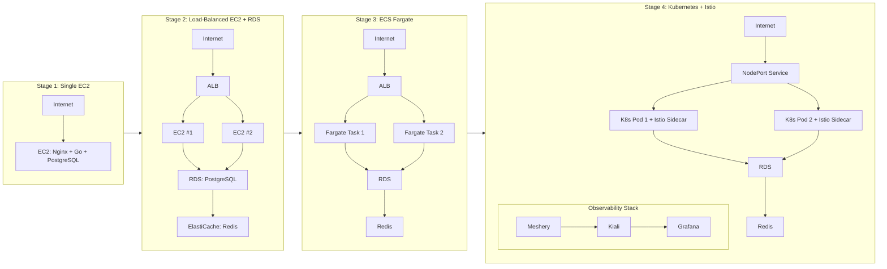
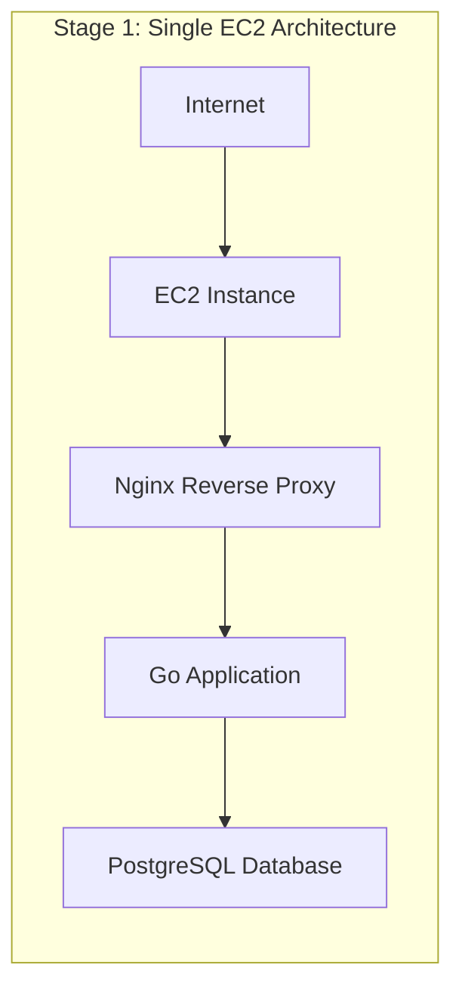
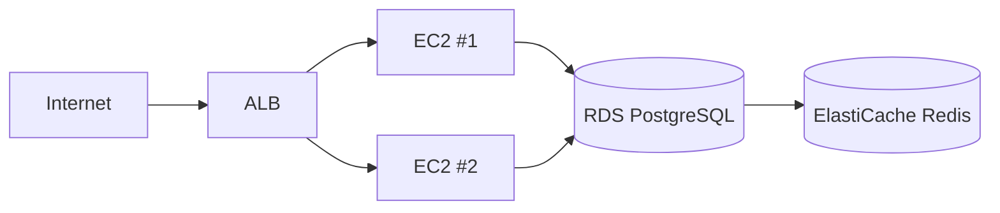
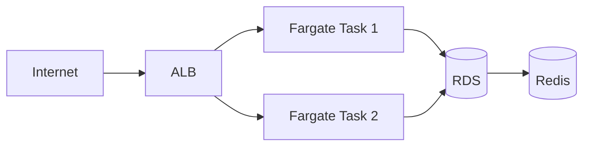
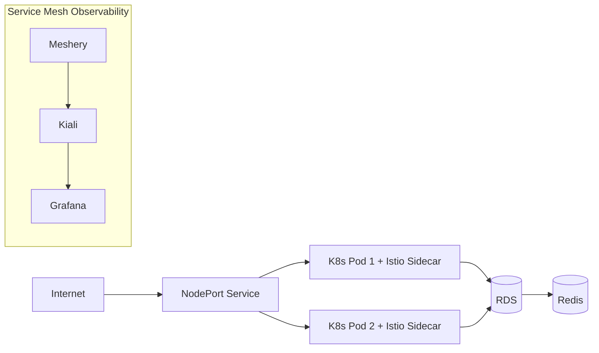
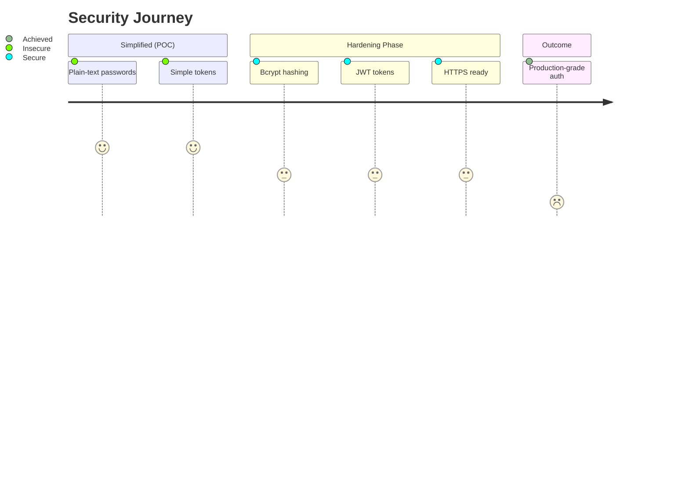

# Infrastructure Experiment Lab — IOC Labs E-Commerce

> An experimental journey building the same application across four infrastructure paradigms to understand trade-offs between **simplicity, cost, control, and scalability**.

**What This Is:** A rapid, hands-on exploration of cloud-native patterns over 5 days  

**What This Isn't:** Production-ready e-commerce (intentionally simplified for learning)  

**Funding:** $550 AWS Lift educational credits (used ~$20 ≈ 3.6%)



## 🛡️ Recent Security Improvements

### Issue #1: Bcrypt Password Hashing  

**Status:** Complete & tested  

- Cryptographic hashing with automatic salting  
- Password strength validation (≥ 8 chars)  
- Generic error messages prevent user enumeration  
- 93.3 % test coverage with unit tests  

**Impact:** Eliminates risk of password leaks on DB compromise  
[📁 Full write-up →](./docs/ISSUE_1_PASSWORD_SECURITY_FIX.md)

---

### Issue #2: JWT Token Implementation  
**Status:** Complete & tested  

- HMAC-SHA256 signed tokens  
- 24-hour expiration  
- Claims-based payload (user_id, issuer, timestamps)  
- Robust validation & error handling  
- 87.5 % test coverage with performance benchmarks  

**Impact:** Prevents forgery & session hijacking  
**Performance:** 10 μs generation / 15 μs validation

---

## ☁️ The Infrastructure Experiment

Built identical functionality four times to answer one question:  
**How do infrastructure choices affect cost, complexity, and capability?**

Each stage ran ~1 day (Stage 4 = 3 days) to deploy → test → understand → tear down.

| Stage | Description | Duration | Cost |
|:------|:-------------|:----------|:------|
| 1 | Single EC2 Instance | 1 day | $0.40 |
| 2 | Load-Balanced EC2 + RDS | 1 day | $2.83 |
| 3 | ECS Fargate | 1 day | $2.00 |
| 4 | Kubernetes + Istio | 3 days | $11.00 |

**Total:** 5 days infra + 2 days security   **≈ $16–20**

---

## Cost Reality Check

| Stage | Monthly | Daily | Runtime | Real Cost |
|-------|----------|--------|----------|-----------|
| 1 | $12 | $0.40 | 1 d | $0.40 |
| 2 | $85 | $2.83 | 1 d | $2.83 |
| 3 | $60 | $2.00 | 1 d | $2.00 |
| 4 | $110 | $3.67 | 3 d | $11.00 |
| **Total** | — | — | **5 d** | **≈ $16-20** |

**Insight:** Rapid iteration → negligible cost.

---

## Performance Under Load

| Stage | 50 Users | 200 Users | Breaking Point | CPU @ Failure |
|:------|:---------:|:----------:|:---------------:|:--------------:|
| 1 | 45 ms | 265 ms | ≈ 150 concurrent | 20 % |
| 2 | 40 ms | 200 ms | ≈ 200 | 18 % |
| 3 | 43 ms | 185 ms | ≈ 500 | 10 % |
| 4 | 47 ms | 210 ms | ≈ 700 | 24 % |

**Observation:** CPU was never the bottleneck — DB connections were.

---

## Architecture Evolution

### Stage 1 — Single Server Baseline



### Stage 2 — Horizontal Scaling



Cost: $2.83 / day Capacity: ~200 users

- Scaling compute didn’t fix DB pool bottleneck.

### Stage 3 — Managed Containers (ECS Fargate)



- Cost: $2.00 / day Capacity: ~500 users

- Simpler ops, better performance than EC2.

### Stage 4 — Kubernetes + Istio


Cost: $3.67 / day Capacity: ~700 users

Most capable yet most complex (+ 50–80 ms latency).

### 🧠 Real Bottlenecks Found

- DB Connection Pool Exhaustion — RDS max ~87 connections

- Connection Mode — Transaction pooling → 3× throughput

- Missing Indexes — Query 150 ms → 12 ms

- Health Check Tuning — Reduced ALB checks = 20 % more pool capacity

Insight: Tuning > Scaling.

### 🔐 Security Evolution



- Bcrypt: salted, cost factor 10 (~90 ms per hash)

- JWT: HMAC-SHA256, 24 h expiry, validated claims

- High test coverage and responsive code reviews

- EC2 termination incident led to Dockerized local dev environment

### 🧾 Key Takeaways

| Area               | Lesson                                                |
| ------------------ | ----------------------------------------------------- |
| **Infrastructure** | Fargate was the sweet spot — simple, cheap, effective |
| **Security**       | Iterative improvement beats initial perfection        |
| **Learning**       | Failure (Lambda) taught as much as success            |
| **Cost**           | $16–20 for end-to-end learning is a bargain           |
| **Complexity**     | K8s teaches why simpler is often better               |

```bash
ioc-labs-ecommerce/
├── cmd/api/              # Entry point
├── internal/
│   ├── auth/             # bcrypt + JWT
│   ├── handlers/         # HTTP handlers
│   ├── services/         # Business logic
│   ├── repository/       # Database access
│   └── middleware/       # Auth, rate limiting
├── pkg/
│   ├── validator/        # Input validation
│   ├── errors/           # Error handling
│   └── database/         # Connection helpers
├── frontend/             # Vanilla JS/HTML
├── migrations/           # SQL migrations
├── infrastructure/
│   ├── stage-1/          # Single EC2
│   ├── stage-2/          # ALB + multi-EC2
│   ├── stage-3-ecs/      # Fargate
│   └── stage-4-k8s/      # K8s + Istio
├── docs/
│   ├── ISSUE_1_PASSWORD_SECURITY_FIX.md
│   ├── SECURITY.md
│   └── stage-summaries/
└── scripts/              # Automation
```

## 🧩 Implemented vs Missing

### ✅ Implemented

1. Bcrypt password hashing
2. JWT authentication
3. Generic error handling
4. Input validation & sanitization
5. Health checks
6. High test coverage

### ⚠️ Missing (POC Scope)

1. Rate limiting / lockouts
2. Email verification & 2FA
3. Password reset flow
4. TLS enforcement + security headers
5. CSRF protection & session refresh
6. CI/CD and advanced monitoring

## 🧭 Conclusion

- If built for production, Stage 3 (Fargate) wins:
- No server management
- Fast deploys (~2 min)
- Auto scaling
- Lower cost & complexity

### Use Kubernetes only when:

- You have 5+ microservices
- Need multi-cloud portability
- Need fine-grained traffic control
- Have dedicated ops team

## 🤝 Contributing

- Contributions that improve documentation or educational value are welcome.

- Open an issue to discuss
- Follow existing code style
- Include tests
- Update docs

### 📜 License

MIT License — Use, fork, and learn freely.

### 🧡 Acknowledgments

- Funded by AWS Lift educational credits ($550 budget, 3.6 % used).
- Special thanks to the code reviewer whose feedback drove security upgrades.
- Experimentation and reflection beat perfection.
- Build the complex thing to learn why the simple thing was better.

- Current Status: All cloud infra torn down | Local dev active
- Cloud Cost: $16–20 (3.6 % of credits)
- Key Lesson: Simplicity wins — but you must build complexity to understand why.
